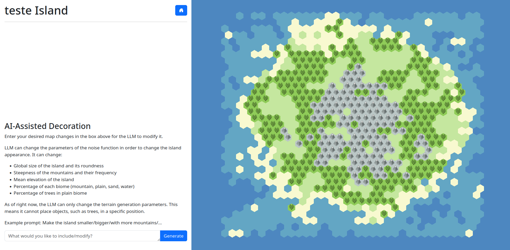
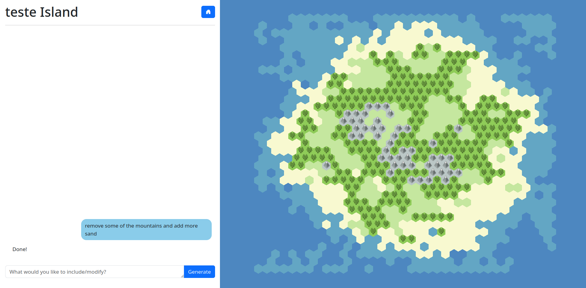

# IslandsML
Use LLMs to procedurally-generate islands with natural language.


## Concept
This project explores the idea of using AI for world building. Specifically, it allows AI to modify parameters of a procedural terrain generator to correspond to a user's described characteristics.

Users can generate new islands and customize their appearance through prompts to a language model. These prompts may include, for example, adjusting biome distribution, altering island size and shape, or modifying mountain steepness. The LLM receives the request along with a description of each configurable parameter of the generator. It then produces a set of configurations that are passed to a terrain generator for rendering, allowing users to visualize the results and request further refinements.

The terrain generator used in this project uses Simplex Noise and it is based on the Red Blob Games' article about map generation (https://www.redblobgames.com/maps/terrain-from-noise/). 

## Architecture and Implementation
This project is divided into three components:

1. **Database**: A relational database that stores all islands. It uses Cloudflare D1.
2. **Frontend**: Uses SvelteKit for the UI and Three.js for island rendering. It is deployed on Cloudflare Pages.
3. **Inference Engine**: A durable workflow receives user prompts from the frontend, processes them using an LLM, and stores the resulting configurations in the database. It operates on Cloudflare Workflows and utilizes Workers AI with the llama-3-8b-instruct model.

The components are interconnected through the use of [Service Bindings](https://developers.cloudflare.com/workers/runtime-apis/bindings/service-bindings/).

## Setup

### Deployment

0. Run `npm i` at the root of the directory to install all the packages


1. Create the database and apply the schema with:
    ```
    # either in frontend/ or workflow/
    npx wrangler@latest d1 create islands-db --location weur --update-config --binding islands_db

    npx wrangler d1 execute islands-db --remote --file=../db_schema.sql
    ```
    Copy the binding name provided, it should look like this:
    ```
    "d1_databases": [
		{
			"binding": "islands_db",
			"database_name": "islands-db",
			"database_id": "xxxxxxxxx",
		}
	]
    ```
2. Copy the contents of `wrangler.sample.jsonc` to `wrangler.jsonc` in both the `frontend/` and `workflow/` folder.

3. Place the database binding at the end of each file

4. In the `workflow/` folder, deploy the workflow with:
    ```
    npx wrangler deploy
    ```

5. In the `frontend/` folder, deploy the UI with:
    ```
    npm run build && npx wrangler pages deploy --project-name islandsai
    ```

6. You should see the project deployed at the address provided by the last command

### Local development

> [!NOTE]
> AI inference always uses cloud services, even in local dev

Follow steps 0. to 3. of the Deployment.

4. Create a local db instance with

    ```
    # either worfklow/ or frontend/
    npx wrangler d1 execute islands-db --local --file=../db_schema.sql --persist-to ../db
    ```

5. Run workflow locally

    ```
    # in worfklow/
    npx wrangler dev
    ```

6. Run the web app locally

    ```
    # in frontend/
    # <BINDING> = database_id pasted in the config file
    npm run build && npx wrangler pages dev --d1 islands_db=<BINDING> --persist-to ../db  
    ```


## Screenshots




